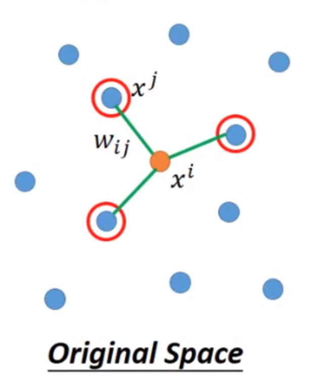

## KDD-Multimodalities-Recall

This is our solution for KDD Cup 2020. We implemented a very neat and simple neural ranking model based on siamese BERT[1] which **ranked FIRST among the solo teams** and ranked 12th among all teams on the final leaderboard.

##### Related Project: [WSDM-Adhoc-Document-Retrieval](https://github.com/chengsyuan/WSDM-Adhoc-Document-Retrieval)

### Features	

* An end-to-end system with **zero feature engineering**.
* Implement the model using **only 36 lines of code**.
* Performed data cleaning on the dataset according to self-designed rules, and removed the abnormal data with an significant negative impact on model performance. 
* Designed a siamese light-BERT with 4-layers to **avoid up to 83% unnecessary computation cost for both training and inference** comparing to the full-percision BERT model.
* **Training on fly**: our model can achieve SOTA performance in **less than 5 hours** using a single V100 GPU card.
* Using a **Local-Linear-Embedding-like method** to increase the NDCG@5 by ~1%.
* Scores are stable (nearly the same) on the validation, testA and testB.

### Our Pipeline

1. Open the jupyter notebook ```jupyter lab or jupyter notebook```
2. Clean the dataset: ```Open 01PRE.ipynb, change the variable 'filename' and run all cells```. In this notebook, we perform base64 decoding process and using BERT tokenizer to covert the queryies into token_id lists. We also convert the data type into float16 to further reduce both disk and memory usage.
3. Model Training: ```Open one of 02MODEL.ipynb and run all cells```. In this notebook, we remove the sample if its bounding box number is higher than 40, which is the also the maximum bounding box number of the test set. Then we use a siamese light-BERT with 4-layers to learning every (query, image) pairs sampled uniformly from the training set. A off-the-shelf framework - pytorch-lightning is used.
4. Inference: ```Open 03INFER.ipynb```. In this notebook, we rewrite the InferSet class to implement our local-linear-embedding-like method. By the way, the inference code is almost the same as validation code so we think it is unnecessay to provide our messy code :).

**Local-Linear-Embedding-like Method**

As mentioned in the step4, we adopted the local-linear-embedding-like method to further enhance the feature.



Given a ROI, we find the top3 most similar ROIs using KNN (K-nearest neighbour) method, then we summed them by weight 0.7, 0.2, 0.1 for keeping the same input numerical scale.

1. **Use pairwise BERT**: When using Bert to scoring sentence pairs, using the [token] vector as output and followed by a single-layer neural network with dropout is recommended.
2. **Use RankNet loss**: Cross-entropy is not the best choice for the ranking problem, because it aims to train the scoring function to be inf or -inf. Such loss benefits to the classification task, while in ranking task, we do not need extreme scores. What we need is more discriminative scores -  the document more related scores higher. That is the Ranknet loss. Limited to the GPU resource, our team can not implement RankNet loss in BERT. Instead, we selected the finetuned models performing well in ranking task, which is so-called underfitting model in the classification tasks. Such practice improves 0.03+ MAP@3 in the validation set.
3. **Use 512 Tokens in Training**: For both training and inference phase, longer token means that the model can capture more semantic information. In our test, increasing token length from 256 to 512 can improve 0.02+ MAP@3.
4. **Upsample Positive Items**: Similar to the classification task, you can upsample the positive (query, doc) pairs or reweight them in the loss item.

### Members

This is a solo team which consisting of:

1. **Chengxuan Ying**, Dalian University of Technology (应承轩 大连理工大学)

### Acknownledgment

Thanks for [Weiwei Xu](http://www.cad.zju.edu.cn/home/weiweixu/weiweixu_en.htm), who provided a 4-GPU server.

### Links to Other Solutions

* Coming soon...

### Future Work

It is worthy to try the SOTA of image-text representation models, like UNITER[2] or OSCAR[3].

### Reference

1. Devlin J, Chang M W, Lee K, et al. Bert: Pre-training of deep bidirectional transformers for language understanding[J]. arXiv preprint arXiv:1810.04805, 2018.
2. Chen Y C, Li L, Yu L, et al. Uniter: Learning universal image-text representations[J]. arXiv preprint arXiv:1909.11740, 2019.
3. Li X, Yin X, Li C, et al. Oscar: Object-Semantics Aligned Pre-training for Vision-Language Tasks[J]. arXiv preprint arXiv:2004.06165, 2020.

### Seeking Opportunities

I will be graduated in the summer of 2021 from Dalian University of Technology. If you can refer me to any company, please contact me [yingchengsyuan@gmail.com](mailto:yingchengsyuan@gmail.com).

